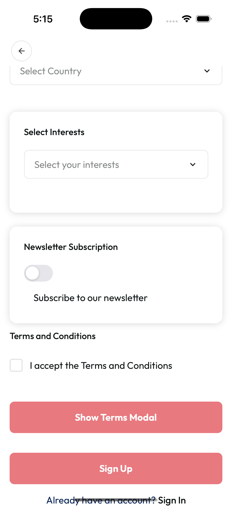

# Card Component

A flexible, theme-aware Card component for React Native, supporting custom header/footer, border, shadow, and more.

## Screenshot



[▶️ View Full Screenshot](../screenshot/card.png)

---

## Features

- ✅ **Customizable Header & Footer**: Add any React node above or below the content
- ✅ **Custom Colors & Borders**: Set background, border color, width, and radius
- ✅ **Custom Padding & Margin**: Control spacing inside and outside the card
- ✅ **Custom Shadow**: Control shadow color, offset, opacity, and radius
- ✅ **Theme Support**: Integrates with your app's theme system
- ✅ **TypeScript**: Full TypeScript support

---

## Installation

This component is part of your project's `shared/ui` library. Import and use directly:

```tsx
import Card from 'shared/ui/card';
```

---

## Usage

### Basic Usage

```tsx
<Card>
  <Text>This is a card!</Text>
</Card>
```

### With Header and Footer

```tsx
<Card
  header={<Text style={{ fontWeight: 'bold' }}>Header</Text>}
  footer={<Text style={{ color: 'gray' }}>Footer</Text>}
>
  <Text>Card content goes here.</Text>
</Card>
```

### Custom Colors, Border, and Shadow

```tsx
<Card
  backgroundColor="#fffbe6"
  borderColor="#ffd700"
  borderWidth={2}
  borderRadius={16}
  padding={24}
  margin={16}
  shadowColor="#ffd700"
  shadowOffset={{ width: 0, height: 4 }}
  shadowOpacity={0.3}
  shadowRadius={12}
  elevation={8}
>
  <Text>Custom styled card</Text>
</Card>
```

---

## Props

| Prop            | Type                         | Default                 | Description                         |
| --------------- | ---------------------------- | ----------------------- | ----------------------------------- |
| children        | ReactNode                    | —                       | Card content                        |
| style           | ViewStyle                    | —                       | Custom style for the card           |
| elevation       | number                       | 3                       | Android elevation & iOS shadow size |
| header          | ReactNode                    | —                       | Optional header above content       |
| footer          | ReactNode                    | —                       | Optional footer below content       |
| backgroundColor | string                       | theme.colors.background | Card background color               |
| borderColor     | string                       | —                       | Card border color                   |
| borderWidth     | number                       | —                       | Card border width                   |
| borderRadius    | number                       | theme spacing default   | Card border radius                  |
| padding         | number                       | theme spacing default   | Card inner padding                  |
| margin          | number                       | theme spacing default   | Card vertical margin                |
| shadowColor     | string                       | #000                    | Shadow color                        |
| shadowOffset    | {width:number,height:number} | {width:0,height:1}      | Shadow offset                       |
| shadowOpacity   | number                       | 0.15                    | Shadow opacity                      |
| shadowRadius    | number                       | elevation\*2            | Shadow blur radius                  |

---

## Styling

- The card adapts to your theme by default.
- You can override all visual aspects with props or custom styles.
- Use header/footer for extra content or actions.

---

## Accessibility

- The card is a simple View, so you can add accessibility props as needed.

---

## Example

```tsx
import Card from 'shared/ui/card';
import { Text } from 'react-native';

export default function Example() {
  return (
    <Card
      header={<Text style={{ fontWeight: 'bold' }}>Header</Text>}
      footer={<Text style={{ color: 'gray' }}>Footer</Text>}
      backgroundColor="#fffbe6"
      borderColor="#ffd700"
      borderWidth={2}
      borderRadius={16}
      padding={24}
      margin={16}
      shadowColor="#ffd700"
      shadowOffset={{ width: 0, height: 4 }}
      shadowOpacity={0.3}
      shadowRadius={12}
      elevation={8}
    >
      <Text>Custom styled card</Text>
    </Card>
  );
}
```

---

## License

MIT (as part of your project)
