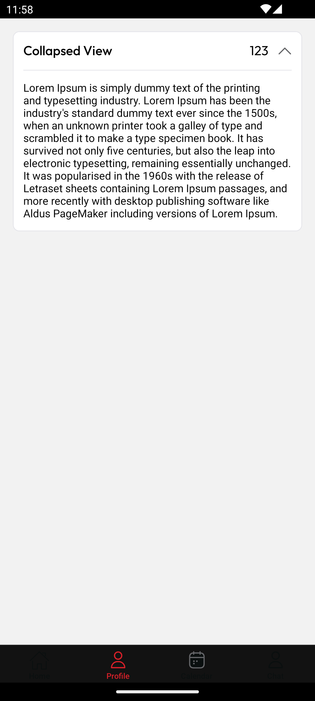

# CollapsibleView Component



[▶️ View Full Screenshot](../screenshot/collapsibleView.png)

A flexible, theme-aware collapsible view component for React Native, featuring smooth expand/collapse animations with customizable header and content.

## Features

- ✅ **Expandable/Collapsible Content**: Smooth animations for showing/hiding content
- ✅ **Customizable Header**: Display label and optional value with custom styling
- ✅ **Chevron Indicators**: Built-in up/down chevron icons that respond to state
- ✅ **Theme Support**: Integrates with your app's theme system
- ✅ **Custom Styling**: Override label and value text styles
- ✅ **TypeScript**: Full TypeScript support

---

## Installation

This component is part of your project's `shared/ui` library. Import and use directly:

```tsx
import CollapsibleView from 'shared/ui/collapsibleView';
```

---

## Usage

### Basic Usage

```tsx
<CollapsibleView label="Basic Section">
  <Text>This content can be collapsed and expanded!</Text>
</CollapsibleView>
```

### With Value Display

```tsx
<CollapsibleView label="User Details" value="John Doe">
  <Text>Name: John Doe</Text>
  <Text>Email: john@example.com</Text>
  <Text>Phone: +1234567890</Text>
</CollapsibleView>
```

### Custom Styling

```tsx
<CollapsibleView
  label="Custom Styled Section"
  value="Important"
  labelStyle={{ fontSize: 18, fontWeight: 'bold', color: '#333' }}
  valueStyle={{ fontSize: 14, color: '#666', fontStyle: 'italic' }}
>
  <Text>Content with custom header styling</Text>
</CollapsibleView>
```

### Complex Content

```tsx
<CollapsibleView label="Order Summary" value="3 items">
  <View style={{ padding: 10 }}>
    <Text>Item 1: $10.00</Text>
    <Text>Item 2: $15.00</Text>
    <Text>Item 3: $8.00</Text>
    <View style={{ borderTopWidth: 1, marginTop: 10, paddingTop: 10 }}>
      <Text style={{ fontWeight: 'bold' }}>Total: $33.00</Text>
    </View>
  </View>
</CollapsibleView>
```

---

## Props

| Prop       | Type      | Default | Description                                 |
| ---------- | --------- | ------- | ------------------------------------------- |
| label      | string    | —       | Main label text displayed in the header     |
| children   | ReactNode | —       | Content to be shown/hidden when collapsed   |
| value      | string    | —       | Optional value text displayed next to label |
| labelStyle | TextStyle | —       | Custom style for the label text             |
| valueStyle | TextStyle | —       | Custom style for the value text             |

---

## Styling

- The component adapts to your theme by default using `colors`, `fonts`, and `moderateScale` from your theme system.
- Container has rounded borders and proper spacing that matches your app's design system.
- Header includes proper padding and spacing for touch interactions.
- Content area has a top border separator when expanded.

---

## Behavior

- **Initial State**: Collapsed by default
- **Interaction**: Tap anywhere on the header to toggle expand/collapse
- **Animation**: Smooth transition using `react-native-collapsible`
- **Visual Feedback**: Chevron icon rotates to indicate current state

---

## Accessibility

- Uses `Pressable` for proper touch handling and accessibility
- Header is fully touchable for easy interaction
- Content is properly hidden/shown for screen readers

---

## Example

```tsx
import React from 'react';
import CollapsibleView from 'shared/ui/collapsibleView';
import { Text, View } from 'react-native';

export default function Example() {
  return (
    <View style={{ padding: 20 }}>
      <CollapsibleView
        label="Account Information"
        value="Premium User"
        labelStyle={{ color: '#2196F3' }}
        valueStyle={{ color: '#4CAF50' }}
      >
        <View style={{ padding: 10 }}>
          <Text>Account Type: Premium</Text>
          <Text>Member Since: January 2024</Text>
          <Text>Status: Active</Text>
        </View>
      </CollapsibleView>
    </View>
  );
}
```

---

## Dependencies

- `react-native-collapsible`: For smooth collapse/expand animations
- Theme system: Uses `colors`, `fonts`, and `moderateScale` from `@src/theme`
- SVG Icons: Uses `ChevronDown` and `ChevronUp` from `@src/assets/svg`

---

## License

MIT (as part of your project)
