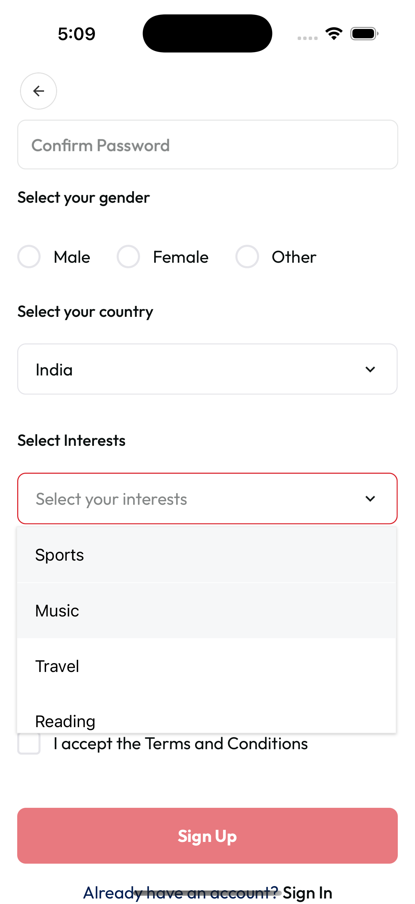
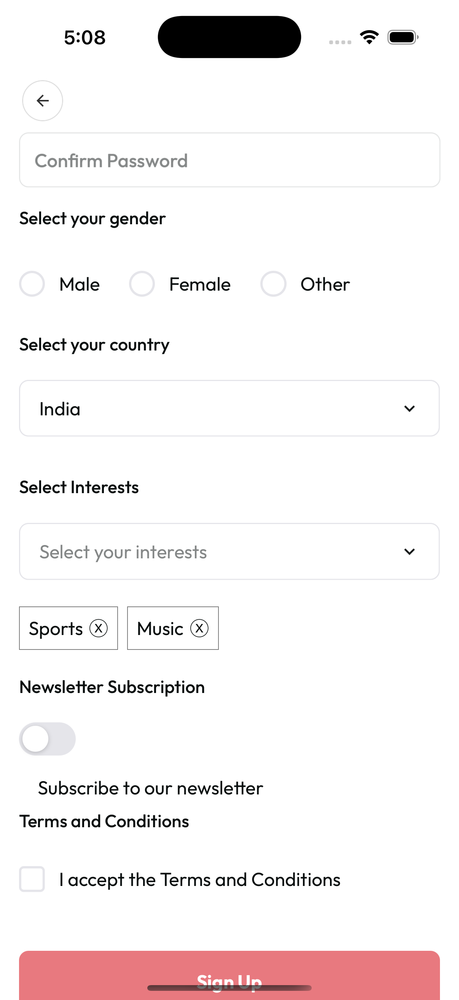

# UI Components

## Dropdown Component


[▶️ View Full Screenshot](../screenshot/singleDropdown.png)


[▶️ View Full Screenshot](../screenshot/multiDropdownSelection.png)


[▶️ View Full Screenshot](../screenshot/multipleDropdown.png)

A customizable dropdown component built with `react-native-element-dropdown` that provides a clean, accessible, and feature-rich dropdown experience.

### Features

- ✅ **Single & Multi-Select**: Supports both single and multi-selection
- ✅ **Searchable**: Built-in search functionality
- ✅ **Customizable**: Extensive styling options
- ✅ **Accessible**: Proper focus and keyboard navigation
- ✅ **Validation**: Built-in error handling and required field support
- ✅ **Theme Support**: Integrates with your app's theme system
- ✅ **TypeScript**: Full TypeScript support
- ✅ **Internationalization**: Support for i18n with `tx` prop

---

### Basic Single-Select Usage

```tsx
import Dropdown from 'shared/ui/Dropdown';

const [value, setValue] = useState<string | number | null>(null);
const options = [
  { label: 'Option 1', value: 'option1' },
  { label: 'Option 2', value: 'option2' },
  { label: 'Option 3', value: 'option3' },
];

<Dropdown
  title="Select Option"
  options={options}
  value={value}
  onChange={setValue}
  placeholder="Choose an option"
/>;
```

---

### Multi-Select Usage

```tsx
import Dropdown from 'shared/ui/Dropdown';

const [selected, setSelected] = useState<string[]>([]);
const multiOptions = [
  { label: 'Apple', value: 'apple' },
  { label: 'Banana', value: 'banana' },
  { label: 'Orange', value: 'orange' },
];

<Dropdown
  title="Select Fruits"
  options={multiOptions}
  value={selected}
  onChange={val => setSelected(Array.isArray(val) ? (val as string[]) : [])}
  multiple
  placeholder="Choose fruits"
/>;
```

---

### Searchable Dropdown

```tsx
<Dropdown
  title="Search Fruits"
  options={multiOptions}
  value={selected}
  onChange={val => setSelected(Array.isArray(val) ? (val as string[]) : [])}
  search
  searchPlaceholder="Type to search fruits..."
  maxHeight={150}
  multiple
  placeholder="Choose fruits"
/>
```

---

### Required Field with Validation

```tsx
<Dropdown
  title="Country"
  options={countryOptions}
  value={selectedCountry}
  onChange={setSelectedCountry}
  required
  error={!selectedCountry ? 'Please select a country' : undefined}
/>
```

---

### Custom Styled Dropdown

```tsx
<Dropdown
  title="Custom Style"
  options={options}
  value={value}
  onChange={setValue}
  style={{
    borderColor: 'blue',
    borderWidth: 2,
    backgroundColor: '#f0f0f0',
  }}
/>
```

---

### Example: Multi-Select in a Form (SignUp Screen)

```tsx
const [interests, setInterests] = useState<string[]>([]);
const interestOptions = [
  { label: 'Sports', value: 'sports' },
  { label: 'Music', value: 'music' },
  { label: 'Travel', value: 'travel' },
  { label: 'Reading', value: 'reading' },
  { label: 'Technology', value: 'technology' },
];

<Dropdown
  title="Select Interests"
  options={interestOptions}
  value={interests}
  onChange={val => setInterests(Array.isArray(val) ? (val as string[]) : [])}
  multiple
  placeholder="Select your interests"
/>;
```

---

## Props

### Required Props

- `options`: Array of dropdown options
- `value`: Currently selected value (string | number | null for single, string[] for multi)
- `onChange`: Callback when selection changes

### Optional Props

**Basic Props**

- `placeholder`: Placeholder text
- `title`: Title displayed above dropdown
- `titleTx`: Translation key for title
- `disabled`: Disable the dropdown
- `style`: Custom styles for the dropdown
- `textStyle`: Custom styles for the text
- `multiple`: Enable multi-select mode
- `renderSelectedItems`: Custom render function for selected items (multi-select)

**Search Props**

- `search`: Enable search functionality
- `searchPlaceholder`: Placeholder for search input
- `maxHeight`: Maximum height of dropdown list

**Validation Props**

- `required`: Mark as required field
- `error`: Error message to display
- `errorTx`: Translation key for error message

---

## Styling

The dropdown component automatically adapts to your theme colors and provides consistent styling. You can customize:

- Border colors and styles
- Background colors
- Text colors and fonts
- Icon colors
- Focus states
- Error states

---

## Migration from Custom Dropdown

The new dropdown component is a drop-in replacement for the previous custom implementation. Key differences:

1. **Better Performance**: Uses a well-tested third-party library
2. **More Features**: Built-in search, better accessibility, multi-select
3. **Cleaner API**: Simplified props interface
4. **Better TypeScript Support**: Improved type safety

---

## Dependencies

- `react-native-element-dropdown`: Core dropdown functionality
- `shared/theme`: Theme integration
- `shared/ui/Text`: Text component for labels and errors
