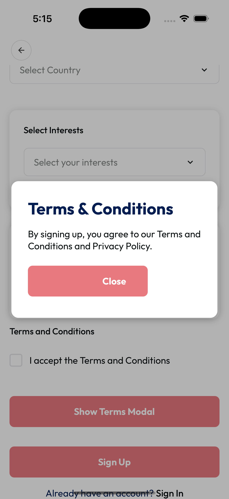

# Modal Component



[▶️ View Full Screenshot](../screenshot/modal.png)

A theme-aware, customizable modal component for React Native, designed for dialogs, popups, and overlays.

## Features

- ✅ **Customizable Overlay & Content**: Style the modal and overlay via props
- ✅ **Dismiss on Overlay Press**: Optional, default enabled
- ✅ **Theme Support**: Integrates with your app's theme system
- ✅ **Accessible**: Uses native modal accessibility
- ✅ **TypeScript**: Full TypeScript support

---

## Installation

This component is part of your project's `shared/ui` library. Import and use directly:

```tsx
import Modal from 'shared/ui/modal';
```

---

## Usage

### Basic Usage

```tsx
const [visible, setVisible] = useState(false);

<Modal visible={visible} onRequestClose={() => setVisible(false)}>
  <Text>This is a modal!</Text>
</Modal>;
```

### Custom Styling

```tsx
<Modal
  visible={visible}
  onRequestClose={() => setVisible(false)}
  style={{ padding: 40, borderRadius: 20 }}
  overlayStyle={{ backgroundColor: 'rgba(0,0,0,0.7)' }}
>
  <Text>Custom styled modal</Text>
</Modal>
```

### Prevent Dismiss on Overlay Press

```tsx
<Modal
  visible={visible}
  onRequestClose={() => setVisible(false)}
  dismissOnOverlayPress={false}
>
  <Text>Clicking outside will NOT close this modal</Text>
</Modal>
```

---

## Props

| Prop                  | Type                 | Default | Description                                                      |
| --------------------- | -------------------- | ------- | ---------------------------------------------------------------- |
| visible               | boolean              | —       | Whether the modal is visible                                     |
| onRequestClose        | () => void           | —       | Called when the modal should close (hardware back, overlay, etc) |
| children              | ReactNode            | —       | Modal content                                                    |
| style                 | StyleProp<ViewStyle> | —       | Custom style for the modal content container                     |
| overlayStyle          | StyleProp<ViewStyle> | —       | Custom style for the overlay background                          |
| dismissOnOverlayPress | boolean              | true    | If true, tapping the overlay will close the modal                |

---

## Customization

- **Modal Content**: Use the `style` prop to change padding, border radius, background, etc.
- **Overlay**: Use the `overlayStyle` prop to change the overlay color, opacity, alignment, etc.
- **Dismiss Behavior**: Set `dismissOnOverlayPress` to `false` to require explicit close actions.

---

## Accessibility

- Uses React Native's `Modal` for proper accessibility and focus management.
- Always provide a way for users to close the modal (e.g., a close button or handler).

---

## Example

```tsx
import React, { useState } from 'react';
import Modal from 'shared/ui/modal';
import { Button, Text } from 'react-native';

export default function Example() {
  const [visible, setVisible] = useState(false);
  return (
    <>
      <Button title="Open Modal" onPress={() => setVisible(true)} />
      <Modal visible={visible} onRequestClose={() => setVisible(false)}>
        <Text>This is a modal dialog!</Text>
        <Button title="Close" onPress={() => setVisible(false)} />
      </Modal>
    </>
  );
}
```

---

## License

MIT (as part of your project)
