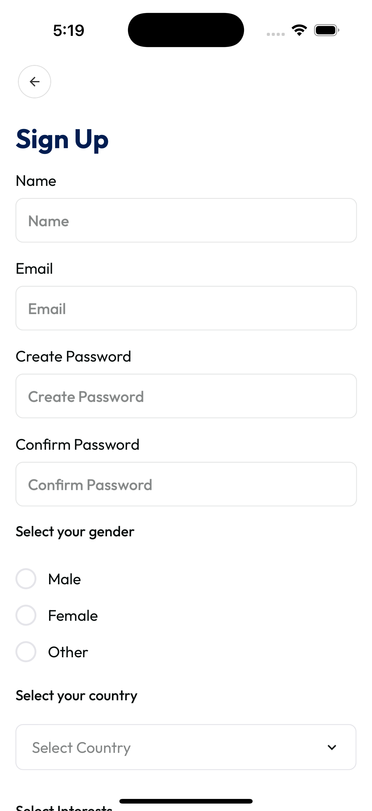

# RadioGroup Component



A flexible, theme-aware RadioGroup component for React Native, supporting custom rendering and easy integration.

## Features

- ✅ **Customizable Rendering**: Render your own radio option or label with `renderOption` and `renderLabel`
- ✅ **Theme Support**: Integrates with your app's theme system
- ✅ **Horizontal/Vertical Layout**: Choose your layout
- ✅ **Accessible**: Proper accessibility roles and states
- ✅ **TypeScript**: Full TypeScript support

---

## Installation

This component is part of your project's `shared/ui` library. Import and use directly:

```tsx
import RadioGroup from 'shared/ui/radioGroup';
```

---

## Usage

### Basic Usage

```tsx
const [selected, setSelected] = useState<string | number | null>(null);
const options = [
  { label: 'Option 1', value: 'option1' },
  { label: 'Option 2', value: 'option2' },
];

<RadioGroup options={options} value={selected} onChange={setSelected} />;
```

### Horizontal Layout

```tsx
<RadioGroup
  options={options}
  value={selected}
  onChange={setSelected}
  horizontal
/>
```

### Custom Option Rendering

```tsx
<RadioGroup
  options={options}
  value={selected}
  onChange={setSelected}
  renderOption={(option, selected, onPress, disabled) => (
    <TouchableOpacity
      key={option.value}
      onPress={onPress}
      disabled={disabled}
      style={{ flexDirection: 'row', alignItems: 'center', margin: 8 }}
    >
      <View
        style={{
          width: 24,
          height: 24,
          borderRadius: 12,
          borderWidth: 2,
          borderColor: selected ? 'green' : 'gray',
          justifyContent: 'center',
          alignItems: 'center',
        }}
      >
        {selected && (
          <View
            style={{
              width: 12,
              height: 12,
              borderRadius: 6,
              backgroundColor: 'green',
            }}
          />
        )}
      </View>
      <Text style={{ marginLeft: 8 }}>{option.label}</Text>
    </TouchableOpacity>
  )}
/>
```

### Custom Label Rendering

```tsx
<RadioGroup
  options={options}
  value={selected}
  onChange={setSelected}
  renderLabel={(option, selected) => (
    <Text
      style={{
        color: selected ? 'blue' : 'black',
        fontWeight: selected ? 'bold' : 'normal',
      }}
    >
      {option.label}
    </Text>
  )}
/>
```

---

## Props

| Prop         | Type                                                           | Default | Description                                  |
| ------------ | -------------------------------------------------------------- | ------- | -------------------------------------------- |
| options      | { label: string; value: string \| number; labelTx?: string }[] | —       | Array of radio options                       |
| value        | string \| number \| null                                       | —       | Currently selected value                     |
| onChange     | (value: string \| number) => void                              | —       | Callback when selection changes              |
| style        | ViewStyle                                                      | —       | Custom style for the group container         |
| optionStyle  | ViewStyle                                                      | —       | Custom style for each option                 |
| labelStyle   | TextStyle                                                      | —       | Custom style for the label text              |
| disabled     | boolean                                                        | false   | Disables all options                         |
| horizontal   | boolean                                                        | false   | Layout options horizontally                  |
| renderOption | (option, selected, onPress, disabled) => ReactNode             | —       | Custom render function for the entire option |
| renderLabel  | (option, selected) => ReactNode                                | —       | Custom render function for the label only    |

---

## Styling

- The radio group adapts to your theme by default.
- You can override option and label styles with `optionStyle` and `labelStyle`.
- Use `renderOption` or `renderLabel` for full control over appearance.

---

## Accessibility

- Uses `accessibilityRole="radio"` and proper `accessibilityState`.
- Fully keyboard/touch accessible.

---

## Example

```tsx
import React, { useState } from 'react';
import RadioGroup from 'shared/ui/radioGroup';

export default function Example() {
  const [selected, setSelected] = useState('option1');
  const options = [
    { label: 'Option 1', value: 'option1' },
    { label: 'Option 2', value: 'option2' },
  ];
  return (
    <RadioGroup
      options={options}
      value={selected}
      onChange={setSelected}
      renderLabel={(option, selected) => (
        <Text style={{ color: selected ? 'red' : 'black' }}>
          {option.label}
        </Text>
      )}
    />
  );
}
```

---

## License

MIT (as part of your project)
