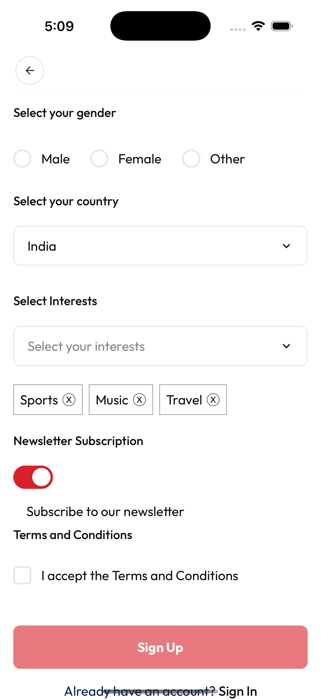

# Switch Component



[▶️ View Full Screenshot](../screenshot/switch.png)

A customizable, theme-aware Switch component for React Native, designed for seamless integration and easy color customization.

## Features

- ✅ **Customizable Colors**: Easily set track and thumb colors for on/off/disabled states
- ✅ **Theme Support**: Integrates with your app's theme system
- ✅ **Accessible**: Proper accessibility roles and states
- ✅ **Animated**: Smooth thumb movement
- ✅ **TypeScript**: Full TypeScript support

---

## Installation

This component is part of your project's `shared/ui` library. Import and use directly:

```tsx
import Switch from 'shared/ui/switch';
```

---

## Usage

### Basic Usage

```tsx
const [isEnabled, setIsEnabled] = useState(false);

<Switch value={isEnabled} onValueChange={setIsEnabled} />;
```

### With Custom Colors

```tsx
<Switch
  value={isEnabled}
  onValueChange={setIsEnabled}
  trackColorOn="#4caf50"
  trackColorOff="#ccc"
  thumbColor="#fff"
  disabledColor="#eee"
/>
```

### Disabled State

```tsx
<Switch value={isEnabled} onValueChange={setIsEnabled} disabled />
```

---

## Props

| Prop          | Type                     | Default                 | Description                          |
| ------------- | ------------------------ | ----------------------- | ------------------------------------ |
| value         | boolean                  | —                       | Current value of the switch (on/off) |
| onValueChange | (value: boolean) => void | —                       | Callback when the value changes      |
| disabled      | boolean                  | false                   | Disables the switch                  |
| style         | ViewStyle                | —                       | Custom style for the container       |
| trackColorOn  | string                   | theme.colors.primary    | Track color when switch is ON        |
| trackColorOff | string                   | theme.colors.border     | Track color when switch is OFF       |
| thumbColor    | string                   | theme.colors.background | Thumb color (circle)                 |
| disabledColor | string                   | —                       | Track color when switch is disabled  |

---

## Styling

- The switch adapts to your theme by default.
- You can override track and thumb colors using the color props.
- The component is sized for touch accessibility and includes a subtle shadow for the thumb.

---

## Accessibility

- Uses `accessibilityRole="switch"` and proper `accessibilityState`.
- Fully keyboard/touch accessible.

---

## Example

```tsx
import React, { useState } from 'react';
import Switch from 'shared/ui/switch';

export default function Example() {
  const [enabled, setEnabled] = useState(false);
  return (
    <Switch
      value={enabled}
      onValueChange={setEnabled}
      trackColorOn="#2196f3"
      trackColorOff="#bdbdbd"
      thumbColor="#fff"
    />
  );
}
```

---

## License

MIT (as part of your project)
